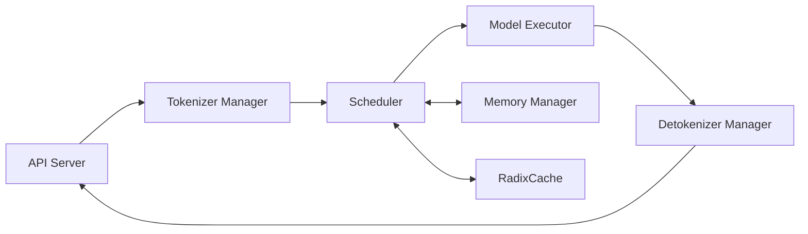

SGLang is designed as a high-performance serving framework for large language models (LLMs) and multimodal models. The system architecture consists of several key components working together to achieve efficient request handling, memory management, and model execution.

## Overview

The SGLang architecture follows a multi-stage pipeline design:



## Core Components

### Scheduler

The Scheduler is the brain of SGLang's serving system, located in `python/sglang/srt/managers/scheduler.py`. It manages:

- **Request Queue Management**: Maintains waiting queues and running batches
- **Continuous Batching**: Dynamically adds and removes requests from batches
- **Memory Coordination**: Works with memory pools to allocate/deallocate KV cache
- **Policy Execution**: Implements scheduling policies (FCFS, LPM, DFS-weight)

<Note>
The Scheduler uses a `running_batch` to track currently executing requests and a `waiting_queue` for pending requests. It continuously decides which requests to admit into the batch based on available memory and scheduling policies.
</Note>

Key initialization components:

```python
class Scheduler:
    def __init__(self, server_args, port_args, gpu_id, tp_rank, ...):
        # Init model configs
        self.init_model_config()
        
        # Launch model worker
        self.init_model_worker()
        
        # Init cache and memory pool
        self.init_cache_with_memory_pool()
        
        # Init schedule policy
        self.init_schedule_policy()
```

Reference: `python/sglang/srt/managers/scheduler.py:266-412`

### Model Executor

The Model Executor consists of two main parts:

#### TpModelWorker

Located in `python/sglang/srt/managers/tp_worker.py`, the TpModelWorker handles:

- **Tensor Parallelism**: Coordinates model sharding across GPUs
- **Batch Preparation**: Transforms ScheduleBatch to ModelWorkerBatch
- **Forward Pass Orchestration**: Manages generation and embedding inference

```python
class TpModelWorker:
    def forward_batch_generation(self, model_worker_batch):
        forward_batch = ForwardBatch.init_new(
            model_worker_batch, self.model_runner
        )
        return self.model_runner.forward(forward_batch)
```

Reference: `python/sglang/srt/managers/tp_worker.py:206-300`

#### ModelRunner

The ModelRunner (`python/sglang/srt/model_executor/model_runner.py`) executes the actual model forward passes:

- **GPU Memory Management**: Allocates KV cache and model weights
- **CUDA Graph Support**: Optimizes repeated patterns
- **Attention Backend Integration**: Supports FlashInfer, FlashAttention, Triton, etc.

### Memory Manager

SGLang implements a two-level memory pool system in `python/sglang/srt/mem_cache/memory_pool.py`:

#### ReqToTokenPool

Maps requests to their token locations:

```python
class ReqToTokenPool:
    def __init__(self, size, max_context_len, device, enable_memory_saver):
        # Store mapping: [req_idx, token_position] -> kv_cache_location
        self.req_to_token = torch.zeros(
            (size, max_context_len), dtype=torch.int32, device=device
        )
        self.free_slots = list(range(size))
```

Reference: `python/sglang/srt/mem_cache/memory_pool.py:126-147`

#### TokenToKVPool

Manages the actual KV cache storage:

- **MHATokenToKVPool**: Multi-head attention KV cache
- **Paged Memory**: Organizes cache in fixed-size pages
- **FP8 Quantization Support**: Optional compression for memory efficiency

<Info>
The memory pool design enables efficient memory reuse through the RadixCache, allowing multiple requests to share common prefix tokens.
</Info>

### RadixCache

The RadixCache (`python/sglang/srt/mem_cache/radix_cache.py`) is a prefix tree data structure that:

- **Detects Shared Prefixes**: Automatically identifies common token sequences
- **Enables Prefix Reuse**: Multiple requests share cached KV states
- **Implements Eviction Policies**: LRU, LFU, FIFO, MRU, FILO, priority-based

See [RadixAttention](/concepts/radix-attention) and [Prefix Caching](/concepts/prefix-caching) for detailed explanations.

## Data Flow

The data flow through SGLang follows this pattern:

### Request Processing Flow

```python
# 1. ScheduleBatch -> ModelWorkerBatch -> ForwardBatch
#    (scheduler.py)    (tp_worker.py)     (model_runner.py)

# ScheduleBatch contains high-level scheduling data (CPU)
class ScheduleBatch:
    reqs: List[Req]  # Request objects
    batch_is_full: bool
    forward_mode: ForwardMode  # EXTEND or DECODE

# ModelWorkerBatch is a subset for model forward (CPU->GPU transfer)
class ModelWorkerBatch:
    # Minimal data needed for forward pass
    ...

# ForwardBatch contains low-level GPU tensors
class ForwardBatch:
    input_ids: torch.Tensor
    req_pool_indices: torch.Tensor
    seq_lens: torch.Tensor
    # ... attention-specific tensors
```

Reference: `python/sglang/srt/managers/schedule_batch.py:20-36`

### Continuous Batching Loop

The scheduler runs an event loop that continuously processes requests:

```python
def event_loop_normal(self):
    while True:
        # 1. Receive new requests
        recv_reqs = self.recv_requests()
        self.process_input_requests(recv_reqs)
        
        # 2. Get next batch to run
        batch = self.get_next_batch_to_run()
        
        # 3. Execute the batch
        if batch:
            result = self.run_batch(batch)
            self.process_batch_result(batch, result)
```

Reference: `python/sglang/srt/managers/scheduler.py:1110-1129`

<Tip>
SGLang also supports an overlapped scheduling mode (`event_loop_overlap`) that overlaps CPU processing with GPU computation for improved throughput.
</Tip>

## Memory Hierarchy

SGLang's memory system has multiple levels:

1. **GPU KV Cache**: Fast on-device storage for active requests
2. **RadixCache Tree**: Logical organization of shared prefixes
3. **Evictable/Protected**: Memory is either locked (in-use) or evictable
4. **Host Storage** (optional): CPU/disk backup for inactive cache

```python
# From radix_cache.py
class RadixCache:
    def evictable_size(self):
        return self.evictable_size_
    
    def protected_size(self):
        # Protected = locked by active requests
        return self.protected_size_
```

Reference: `python/sglang/srt/mem_cache/radix_cache.py:641-646`

## Scheduling Policies

SGLang supports multiple scheduling policies in `python/sglang/srt/managers/schedule_policy.py`:

### Cache-Aware Policies

- **LPM (Longest Prefix Match)**: Prioritizes requests with longer cached prefixes
- **DFS-Weight**: Uses depth-first weighting to maximize cache reuse

### Cache-Agnostic Policies

- **FCFS**: First-come-first-served
- **LOF**: Longest output first
- **Random**: Random ordering
- **Routing-Key**: Groups by routing keys for better batching

<Note>
Cache-aware policies provide better throughput when RadixCache is enabled by maximizing prefix reuse.
</Note>

## Distributed Execution

SGLang supports multiple parallelism strategies:

- **Tensor Parallelism (TP)**: Shards model weights across GPUs
- **Pipeline Parallelism (PP)**: Splits model layers across devices
- **Data Parallelism (DP)**: Replicates model for different request batches
- **Expert Parallelism (EP)**: For MoE models, distributes experts

The system coordinates these through NCCL communication groups initialized during startup.

## Key Performance Optimizations

### 1. RadixAttention with Prefix Caching

Automatic detection and reuse of common prefixes across requests. See [RadixAttention](/concepts/radix-attention).

### 2. Continuous Batching

Dynamic batch composition allows requests to enter/exit without waiting. See [Continuous Batching](/concepts/continuous-batching).

### 3. CUDA Graphs

Captures and replays kernel launches for decode phases, reducing CPU overhead.

### 4. Paged KV Cache

Non-contiguous memory allocation reduces fragmentation and enables flexible memory management.

### 5. Chunked Prefill

Large prefill requests can be split into chunks to better interleave with decode requests.

## Configuration

Key configuration parameters:

```python
# Memory management
--mem-fraction-static 0.9  # GPU memory for KV cache
--max-running-requests 256  # Batch size limit
--max-total-tokens 16384   # Token capacity

# Scheduling
--schedule-policy lpm      # Use longest prefix match
--schedule-conservativeness 1.0  # Memory headroom

# Caching
--disable-radix-cache      # Disable prefix caching
--chunked-prefill-size 2048  # Enable chunked prefill
```

## Related Topics

- [RadixAttention](/concepts/radix-attention) - The core attention mechanism
- [Prefix Caching](/concepts/prefix-caching) - How prefix caching works
- [Continuous Batching](/concepts/continuous-batching) - Dynamic request batching
